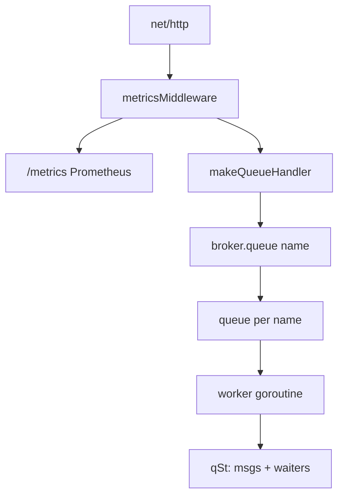
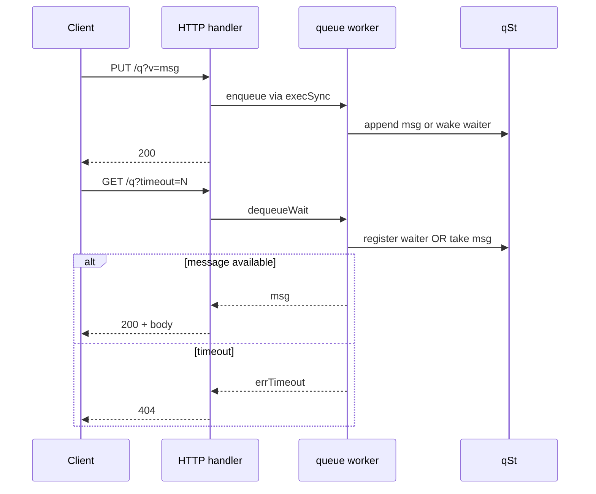

# In-memory HTTP queue broker (Go)

[](https://github.com/XaCaMaCa/queue-broker-go-test/actions/workflows/ci.yml)
[](https://go.dev/)

Минимальный HTTP-брокер очередей в памяти: **FIFO**, **long-polling** с таймаутом, **per-queue** воркер (одна горутина на очередь), **graceful shutdown** (SIGINT/SIGTERM), структурные логи через `slog`, метрики **Prometheus** на `/metrics`.

Изначально тестовое задание; дальше доработано под продакшен-практики: тесты (unit, HTTP, конкурентность), корректное завершение, ответ **503** при остановке, счётчики и гистограммы для наблюдаемости.

## API

Базовый путь: `/{queueName}` — имя очереди одним сегментом (без `/` внутри).

| Метод | URL | Описание |
|--------|-----|----------|
| `PUT` | `/{queue}?v=<payload>` | Положить сообщение в очередь. Параметр `v` обязателен (значение может быть пустым: `?v=`). |
| `GET` | `/{queue}` | Взять сообщение без ожидания. Пустая очередь → **404**. |
| `GET` | `/{queue}?timeout=<секунды>` | Long-poll: ждать до `timeout` секунд. Сообщение пришло → **200** и тело. Таймаут → **404**. Некорректный `timeout` → **400**. |
| другие методы | `/{queue}` | **405** |

При остановке сервера после сигнала: новые `PUT`/`GET` с ожиданием → **503 Service Unavailable**.

## Метрики (Prometheus)

Эндпоинт **`GET /metrics`** отдаёт текст в формате exposition Prometheus (регистр по умолчанию).

| Имя | Тип | Назначение |
|-----|-----|------------|
| `queuebroker_http_requests_total` | counter | HTTP-запросы по `method` и `code` (включая `/metrics`). |
| `queuebroker_longpoll_wait_seconds` | histogram | Время от входа в long-poll до ответа (успех, таймаут или shutdown после ожидания). |
| `queuebroker_messages_enqueued_total` | counter | Успешные `PUT` после записи в очередь. |
| `queuebroker_messages_delivered_total` | counter | Ответы `200` с телом сообщения (`GET`). |

Имена очередей в лейблы **не выводятся** (чтобы не раздувать кардинальность).

Пример:

```bash
curl -s "http://localhost:8080/metrics" | findstr queuebroker
```

## Запуск

```bash
go run . 8080
```

Пример:

```bash
curl -X PUT "http://localhost:8080/orders?v=hello"
curl "http://localhost:8080/orders"
```

Long-poll:

```bash
curl "http://localhost:8080/orders?timeout=30"
```

Остановка: **Ctrl+C** (или SIGTERM). Сервер завершит `http.Server.Shutdown`, закроет брокер и разбудит ожидающих потребителей.

## Тесты

```bash
go test -v ./...
```

С race detector на Linux/macOS (нужен `gcc` / cgo):

```bash
go test -race -v ./...
```

На Windows без MinGW/`gcc` локально удобно гонять без `-race`; в CI прогон с `-race` включён.

Если в родительской папке есть `go.work` и модуль в него не добавлен:

```powershell
$env:GOWORK = "off"
go test -v ./...
```

## Архитектура

Очередь — **actor**: все изменения состояния проходят через канал `chan func(*qSt)` и одну горутину-воркер на очередь. Снаружи — `sync.Mutex` только на карте очередей в `broker`.





## Структура репозитория

| Файл | Назначение |
|------|------------|
| `main.go` | Брокер, очередь, HTTP, `newAppHandler`, graceful shutdown, `slog` |
| `metrics.go` | Prometheus: счётчики, гистограмма long-poll, middleware, `/metrics` |
| `broker_test.go` | Unit-тесты FIFO, таймаут, waiters, shutdown |
| `http_test.go` | Интеграционные тесты через `httptest`, в т.ч. `/metrics` |
| `concurrent_test.go` | Конкурентные сценарии без потери сообщений |

Зависимости фиксируются в **`go.sum`** (нужен в репозитории для воспроизводимых сборок и CI).

## Модуль

```text
module queuebroker
go 1.22

require github.com/prometheus/client_golang v1.20.5
```

## Использование кода

Репозиторий выложен **только для демонстрации** навыков (портфолио, собеседования). Исходный код **не предназначен** для свободного копирования, распространения или использования в продуктах без отдельного письменного разрешения автора. Все права защищены.
